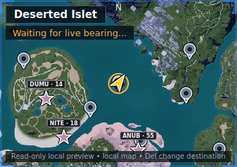

# PalPlus

Your Palworld map, always within reach.

PalPlus is a lightweight Windows companion that adds a live minimap, quick destination search, and useful map markers without ads, accounts, or online tracking.

[**Download the latest Windows installer**](https://github.com/shin86dev/palworld-companion/releases/latest/download/PalPlus-Setup.exe) · [**Verify its SHA-256**](https://github.com/shin86dev/palworld-companion/releases/latest/download/PalPlus-Setup.exe.sha256) · [**Support PalPlus on Ko-fi**](https://ko-fi.com/shin86dev)

## Find your way without leaving the game

- See your live position and heading on a compact minimap.
- Find fast-travel points, watchtowers, and Alpha Pals.
- Press `Delete` and type a destination—or paste map coordinates.
- See which travel points are unlocked and which Alpha first clears remain.
- Zoom, reposition, and toggle Alpha markers while a Palworld menu is open.
- Move between monitors, resize the game, or switch fullscreen modes without losing the minimap.

The overlay stays click-through while you play and gets out of the way when Palworld is minimized or unfocused.

## Install

1. Download `PalPlus-Setup.exe` from the latest release.
2. Optionally verify it against the accompanying `PalPlus-Setup.exe.sha256` file.
3. Run the installer and launch PalPlus from the Start menu.
4. Start Palworld. The minimap will appear when the game is ready.

PalPlus installs for your Windows user and does not request administrator access. Uninstalling it leaves your preferences intact.

> [!NOTE]
> PalPlus is currently unsigned, so Windows SmartScreen may show an “unrecognized app” warning. Download only from this repository and verify the release checksum if you want an additional integrity check.

## Controls

| Action | Control |
| --- | --- |
| Search for a destination | `Delete` |
| Destination-search fallback | `Ctrl+Alt+P` |
| Show or hide the minimap | `Ctrl+Alt+M` |
| Zoom the minimap | Mouse wheel or slider while a game menu is open |
| Reposition the minimap | Left-drag while a game menu is open |
| Quit PalPlus | Right-click the PalPlus tray icon |

## Private by design

PalPlus runs locally on your PC. It has:

- No account requirement
- No ads or analytics
- No cloud uploads
- No AI or LLM calls
- No gameplay automation
- No game-memory writes or injection

PalPlus prepares its map cache from your local Palworld installation. The app does not upload that cache or your gameplay data.

## Troubleshooting

**The minimap disappeared**

Return focus to Palworld. PalPlus intentionally hides over other applications and while the game is minimized.

**Palworld updated and live features paused**

PalPlus checks compatibility locally after game updates. If it cannot validate the new build safely, live features stay off until compatibility is restored.

**The map image is not ready**

PalPlus displays a coordinate grid while it prepares the private local map cache.

If something still looks wrong, open an issue with your Palworld version and a short description of what happened.

## Support PalPlus

PalPlus is free, ad-free, and built as an independent side project. If it has been useful, you can [support it on Ko-fi](https://ko-fi.com/shin86dev). Donations will never gate downloads or features.

## About

PalPlus is an independent community project and is not affiliated with or endorsed by Pocketpair. It is distributed under the [GNU GPLv3](LICENSE), with third-party acknowledgements in [THIRD_PARTY_NOTICES.md](THIRD_PARTY_NOTICES.md).
